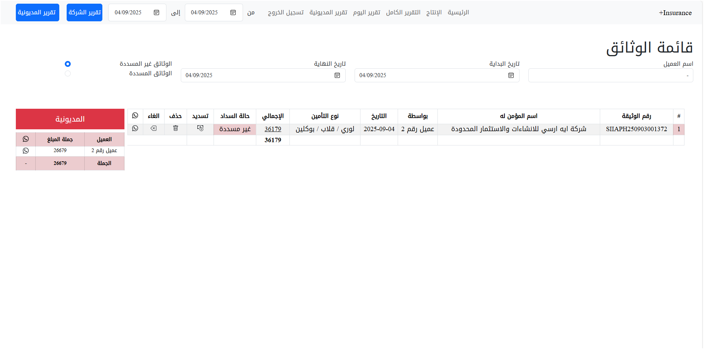
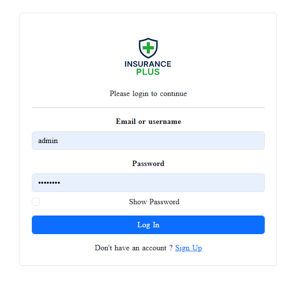
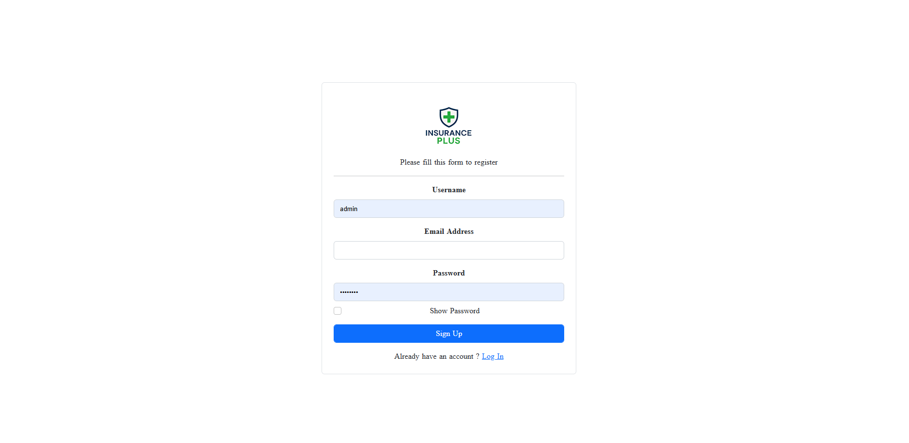
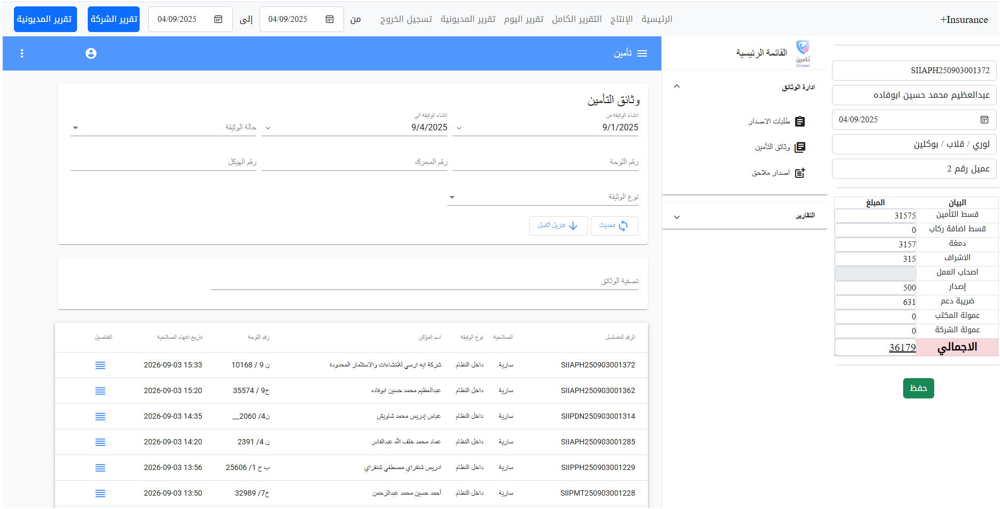
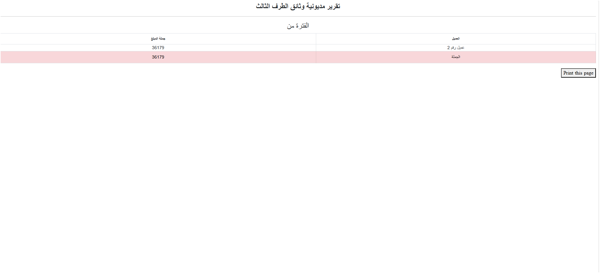
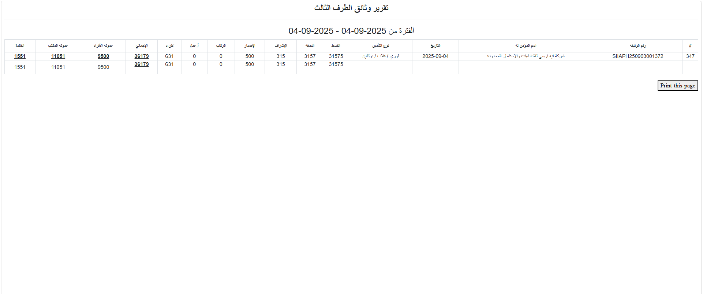
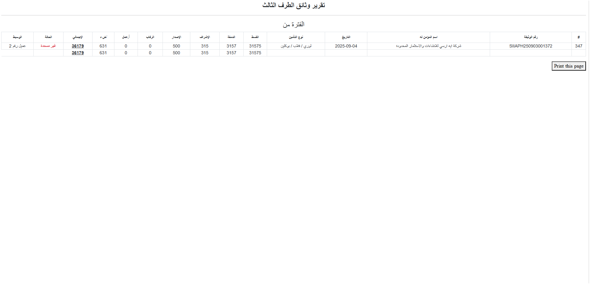

# 🚗 Insurance Plus | نظام إدارة معاملات التأمين

نظام مكتبي متكامل لتسجيل وإدارة معاملات التأمين الإجباري، مصمم خصيصًا لمكاتب فونكس في السودان. يهدف إلى تبسيط العمليات المالية، إصدار الفواتير، ومتابعة الحسابات الشخصية والوسطاء والعملاء الدائمين.

---

## 🧩 مكونات النظام

- تسجيل الدخول والتسجيل للمستخدمين
- إدارة الحسابات الشخصية للمكتب
- إصدار الفواتير للعملاء والوسطاء
- تقارير مالية مفصلة وقابلة للطباعة
- إرسال فواتير عبر SMS (للمشتركين)
- نظام سداد ومتابعة مالية شامل

---

## 📂 ملفات المشروع

- ملفات النظام الأساسية (PHP):  
  `index.php`, `login.php`, `report.php`, `payment.php`, `cancel.php`, `debit.php`, `deposit.php`, `logout.php`, `print.php`, وغيرها

- قاعدة البيانات:  
  `db/db.sql`

- ملفات التصميم والواجهة:  
  `css/`, `js/`, `img/`

- صور النظام:  
  `screenshots/`
  ## 🖼️ لقطات من النظام

| الصفحة الرئيسية | تسجيل الدخول | التسجيل |
|------------------|----------------|-----------|
|  |  |  |

| الإنتاج | تقرير 1 | تقرير 2 |
|-----------|-----------|-----------|
|  |  |  |

| تقرير 3 |
|-----------|
|  |


- ملف التهيئة والاتصال:  
  `config.php`, `db_conn.php`

---

## 🔐 بيانات الدخول الافتراضية

```plaintext
اسم المستخدم: admin
كلمة المرور: Admin
